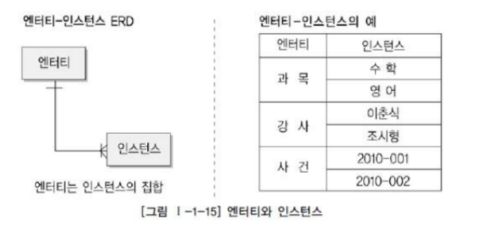
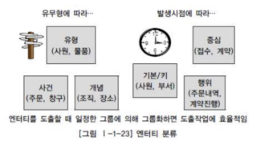
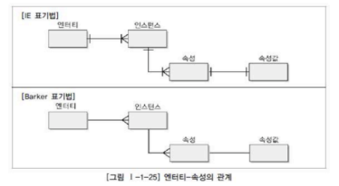
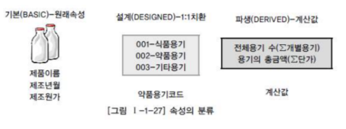
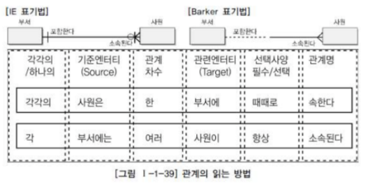
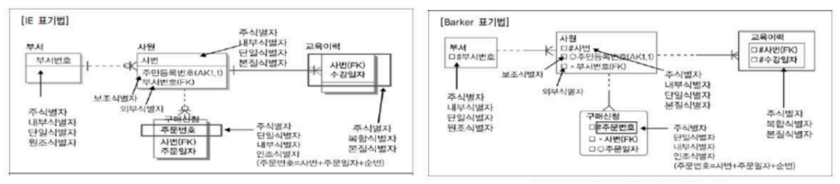
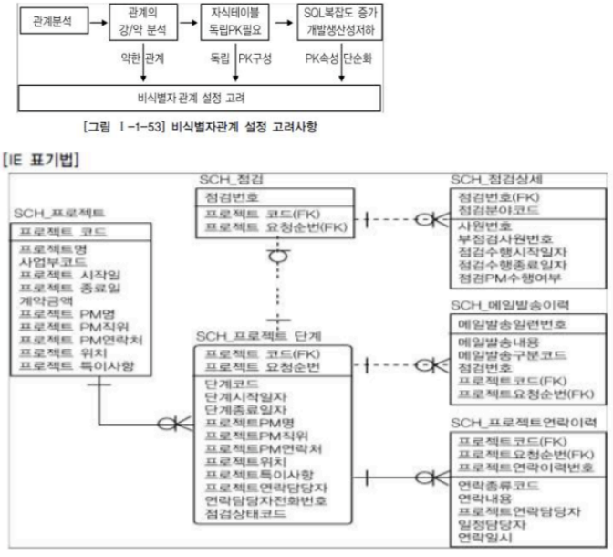

# 제1장 데이터모델링의 이해

## 제 1절 데이터모델의 이해

### 1. 모델링의 이해1

1. 모델링의 정의 : '다양한 현상을 표기법에 의해 표기하는 것'

2. 특징 3가지 : `추상화`, `단순화`, `명확화`

3. 모델링의 3가지 관점 : 데이터 관점, 프로세스 관점, 상관 관점

### 2. 데이터모델의 기본개념이해

1. 데이터모델링의 정의 : '정보시스템을 구축하기 위한 데이터관점의 업무분석기법'

2. 데이터모델이 제공하는 기능
   
   - 시스템 가시화, 시스템 구조와 행동 명세화, 시스템구축의 구조화된 틀 제공
   
   - 문서화, 세부 사항은 숨기는 다양한 관점 제공, 상세 수준의 표현방법 제공

### 3. 데이터모델링의 중요성 및 유의점

| 중요성                | 유의점(중요)                                |
| ------------------ | -------------------------------------- |
| 파급효과               | 중복 - 데이터베이스가 여러 장소에 같은 정보를 저장하지 않게 함   |
| 복잡한 정보요구사항의 간결한 표현 | 비유연성 - 데이터정의를 데이터 사용 프로세스와 분리          |
| 데이터 품질             | 비일관성 - ex)신용상태에 대한 갱신 없이 고객의 납부이력정보 갱신 |

### 

### 4. 데이터모델링의 3단계 진행

1. 개념적 데이터모델링 : 추상화 수준이 높고 업무 중심적이고 포괄적인 수준의 모델링 진행

2. 논리적 데이터모델링 : 시스템으로 구축하고자하는 업무에 대해 Key, 속성, 관계 등을 정확하게 표현, 높은 재사용

3. 물리적 데이터모델링 : 실제로 데이터베이스에 이식할 수 있도록 성능, 저장 등 물리적인 성격 고려 설계

### 5. 프로젝트 생명주기에서 데이터모델링

- 계획 단계 -> 개념적 모델링 // 분석단계 -> 논리적 모델링 // 설계단계 -> 물리적 모델링

- 실제는 : 분석단계에서 -> 개념적 + 논리적 모델링 // 설계단계 -> 물리적 모델링

### 6. 데이터모델링에서 데이터 독립성의 이해

- 데이터 독립성의 필요성 : 유지보수비용 증가, 데이터 복잡도 증가. 데이터 중복성 증가, 요구사항 대응 저하

- 데이터베이스 3단계구조 : 외부단계 / 개념적 단계 / 내부적 단계

- 데이터 독립성 요소 : 외부스키마 / 개념스키마 / 내부스키마

- 두 영역의 데이터 독립성 : 논리적 독립성, 물리적 독립성

- **사상 'Mapping' : "상호 독립적인 개념을 연결시켜주는 다리"** /
  
  **외부적/개념적 사상 + 개념적/물리적 사상**

### 7. 데이터모델링의 중요한 3가지 개념

1. 데이터모델링의 세가지 요소
   
   1). 업무가 관여하는 어떤 것(Things)
   
   2). 어떤 것이 가지는 성격(Attributes)
   
   3). 업무가 관여하는 어떤 것 간의 관계(Relationships)

2. 단수와 집합(복수)의 명명

| 개념                       | 복수/집합개념 & 타입/클래스   | 개별/단수개념 & 어커런스/인스턴스               |
|:------------------------:| ------------------ | --------------------------------- |
| 어떤 것(Thing)              | 엔티티타입(Entity Type) | 엔티티(Entity)                       |
|                          | 엔티티(Entity)        | 인스턴스(Instance) / 어커런스(Occurrence) |
| 어떤 것간의 연관(Relationships) | 관계(Relationship)   | 패어링(Pairing)                      |
| 어떤 것의 성격(Attibutes)      | 속성(Attribute)      | 속성값(Attribute Value)              |

### 

### 8. 데이터모델링의 이해관계자

- 이해관계자의 데이터 모델링 중요성 인식

- 데이터 모델링의 이해관계자

### 9. 데이터모델의 표기법인 ERD의 이해

- 데이터 모델 표기법 : 엔티티를 사각형으로 표현, 관계를 마름모, 속성을 타원형으로 표현

- ERD(Entity Relationship Diagram)표기법을 이용하여 모델링하는 방법
  
  엔티티그리기 -> 엔티티 배치 -> 엔티티간의 관계설정 -> 관계명 기술 -> 관계의 참여도 기술 -> 관계의 필수여부기술

### 10. 좋은 데이터모델의 요소(중요)

- 완전성 / 중복배제 / 업무규칙 / 데이터 재사용 / 의사소통 / 통합성

## 제2 절 엔티티

### 1. 엔티티의 개념

- "실체, 객체"

### 2. 엔티티와 인스턴스에 대한 내용과 표기법

        

### 

### 3. 엔티티의 특징

- 업무에서 필요로 하는 정보

- 식별자에 의해 식별이 가능해야 함

- 인스턴스의 집합

- 업무프로세스에 의해 이용

- 속성을 포함

- 관계의 존재

### 4. 엔티티의 분류

- 유무형에 따른 분류 : 유형 엔티티, 개념 엔티티, 사건 엔티티

- 발생시점에 따른 분류 : 기본 엔티티, 중심 엔티티, 행위 엔티티

- 엔티티 분류방법의 예
  
    

### 

### 5. 엔티티의 명명

- 업무목적에 따라 생성되는 자연스러운 이름을 부여

## 제 3절 속성

### 1. 속성의 개념

- "업무에서 필요로 하는 인스턴스로 관리하고자하는 의미상 더 이상 분리되지 않는 최소 데이터 단위"

### 2. 엔티티, 인스턴스와 속성, 속성값에 대한 내용과 표기법

- **엔티티, 인스턴스, 속성, 속성값의 관계 (중요)**
  
  - 1개의 `엔티티`는 2개 이상의 `인스턴스 집합`이어야 한다.
  
  - 1개의 `엔티티`는 2개 이상의 `속성`을 갖는다.
  
  - 1개의 `속성`은 1개의 `속성값`을 갖는다.

- 속성의 표기법 : IE표기법, Barker표기법

        

### 3. 속성의 특징

- 하나의 속성에는 한 개의 값. 하나의 속성에 여러 개의 값이 있는 다중값일 경우 별도의 엔티티를 이용하여 분리

### 4. 속성의 분류

- **속성의 특성에 따른 분류 (중요)** : 기본속성, 설계속성, 파생속성

        

- 엔티티 구성방식에 따른 분류
  
  - 엔티티를 식별할 수 있는 속성을 PK 속성
  
  - 다른 엔티티와의 관계에서 포함된 속성을 FK속성
  
  - 엔티티에 포함되어 있고 PK,FK에 포함되지 않은 속성을 일반속성이라 한다.
  
  - 의미를 쪼갤 수 있는지에 따라 단순형, 복합형으로 분류할 수 있다.
  
  - 속성 하나에 1개의 값 -> 단일값(Single Value) / 여러 개의 값 -> 다중값(Multi Value)

### 5. 도메인(중요)

- "각 속성이 가질 수 있는 값의 범위"
  
  -> 엔티티 내에서 속성에 대한 데이터 타입과 크기 그리고 제약사항을 지정하는 것

## 제4 절 관계

### 1. 관계의 개념

- 관계의 정의
  
  - "엔티티의 인스턴스 사이의 논리적인 연관성으로서 존재의 형태로서나 행위로서 서로에게 연관성이 부여된 상태"

- 관계의 페어링 : "페어링은 엔티티안에 인스턴스가 개별적으로 관계를 가지는 것이고, 이것의 집합을 관계로 표현"

- 관계의 분류
  
  - ERD : 존재에 의한 관계 / 행위에 의한 관계
  
  - UML(Unified Modeling Language) : 연관 관계 / 의존 관계

### 2. 관계의 표기법

- 관계명 : 관계의 이름

- 관계 차수 :  1:1, 1:M, M:N

- 관계선택사양 : 필수관계, 선택관계

        

### 3. 관계의 정의 및 읽는 방법

- 관계체크사항

- 관계읽기

## 제 5절 식별자

### 1. 식별자 개념

- 하나의 엔티티에 구성되어있는 여러 개의 속성 중에 엔티티를 대표할 수 있는 속성을 의미하며 `하나의 엔티티는 반드시 하나의 유일한 식별자가 존재해야 한다.`

### 2. 식별자의 특징(중요)

- 유일성, 최소성, 불변성, 존재성

### 3. 식별자분류 및 표기법(중요)

- 식별자 분류 : 주식별자 보조식별자 / 내부식별자와 외부식별자 / 단일식별자와 복합식별자, 본질식별자와 인조식별자

- 식별자 표기법

### 4. 주식별자 도출기준

- 해당업무에서 자주 이용되는 속성을 주식별자로 지정하도록함

- 명칭, 내역 등과 같이 이름으로 기술되는 것을 피함

- 속성의 수가 많아지지 않도록 함

### 5. 식별자관계와 비식별자 관계에 따른 식별자

- 식별자관계와 비식별자 관계의 결정 : 외부식별자는 Foreign Key 역할을 한다.

- 식별자 관계 : "자식엔티티의 주식별자로 부모의 주식별자가 상속이 되는 경우"

                                Null값이 오면 안되므로 반드시 부모엔티티가 생성되어야 자기자신

                                의 엔티티 생성

- 비식별자 관계 : "부모 엔티티로부터 속성으로 받았지만 자식엔티티의 주식별자로                             이용하지 않고 일반적인 속성으로만 사용하는 경우"

- 식별자관계로만 설정할 경우의 문제점 : 주식별자 속성이 지속적으로 증가, 복잡성과 오류 가능성 유발

- 비식별자관계로만 설정한 경우의 문제점 : 쓸데없이 부모엔티티까지 찾아가야 하는 경우가 발생한다.

- 식별자관계와 비식별자관계 모델링 : 비식별자관계 선택프로세스, 식별자와 비식별자 관계비교, 식별자와 비식별자를 적용

  
