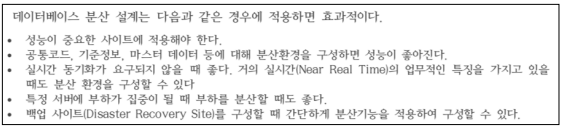
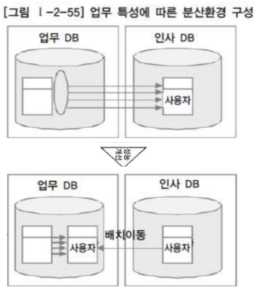

# 제 2장 데이터 모델과 성능

## 제 1절 성능 데이터 모델링의 개요

### 1. 성능데이터모델링의 정의

- 데이터모델링을 할 때 어떤 작업 유형에 따라 성능향상을 도모해야 하는지 목표를 분명하게 해야 정확한 성능향상 모델링을 할 수 있다.

### 2. 성능 데이터모델링 수행 시점

- 분석 / 설계단계에서 데이터베이스 처리 성능을 향상시킬 수 있는 방법을 고려해야 한다.

### 3. 성능 데이터 모델링 고려 사항

- 정규화, 반정규화..

## 제 2절 정규화와 성능

### 1. 정규화를 통한 성능향상 전략

- (중요) "데이터에 대한 중복성을 제거하여 준다."

- 일반적으로 정규화가 잘 되어 있으면 입력 / 수정 / 삭제의 성능이 향상되고 반정규화를 많이 하면 조회의 성능이 향상된다.

- 중복 속성에 대한 분리가 1차 정규화의 정의임. 로우단위의 대상, 칼럼 단위로 중복도 해당

### 2. 반정규화된 테이블의 성능저하 사례1 ~ 4

### 3. 함수적 종속성에 근거한 정규화 수행 필요(중요)

- 함수의 종속성(Functional Dependency)은 데이터들이 어떤 기준값에 의해 종속되는 현상을 지칭하는 것이다.

- 결정자 예) 주민등록번호 // 종속자 예) 이름, 출생지, 주소

## 제 3절 반정규화와 성능

### 1. 반정규화를 통한 성능향상 전략

- 반정규화의 정의
  
  - "정규화된 엔티티, 속성, 관계에 대해 시스템의 성능향상과 개발과 운영의 단순화를 위해 중복, 통합, 분리 등을 수행하는 데이터모델링 기법"
    
    조인으로 인한 성능 저하가 예상될 때 등

- 반정규화의 적용 방법
  
  - 반정규화 대상 조사, 다른 방법 유도 검토, 반정규화 적용

### 2. 반정규화 기법

- 테이블 반정규화 : 테이블병합, 테이블분할, 테이블추가

- 칼럼 반정규화 : 중복칼럼 추가, 파생칼럼 추가, 이력테이블칼럼 추가, PK에 의한 칼럼 추가, 응용시스템 오작동을 위한 칼럼 추가

- 관계 반정규화 : 중복관계추가

### 3. 정규화가 잘 정의된 데이터모델에서 성능이 저하될 수 있는 경우

### 4. 정규화가 잘 정의된 데이터모델에서 성능이 저하된 경우

## 제 4절 대량데이터에 따른 성능

### 1. 대량데이터 발생에 따른 테이블 분할 개요

- 로우 체이닝(Row Chaining) - '로우길이가 너무 길어서 데이터블록하나에 데이터가 모두 저장되지 않고 두개 이상 저장'

- 로우 마이그레이션(Row Migration) - '데이터블록에서 수정이 발생하면 수정된 데이터를 해당 데이터블록에서 저장하지 못하고 다른 블록의 빈 공간을 찾아 저장하는 방식'

### 2. 한 테이블에 많은 수의 갈럼을 가지고 있는 경우

### 3. 대량 데이터 저장 및 처리로 인한 성능

- RANGE PARTITION 적용

- LIST PARTITION 적용

- HASH PARTITION 적용

### 4. 테이블에 대한 수평 분할 / 수직 분할의 절차

## 제 5절 데이터베이스 구조와 성능

### 1. 슈퍼타입 / 서브타입 모델의 성능고려방법

- 슈퍼/서브타입 데이터모델의 개요
  
  - 'Extended ER 모델', 업무를 구성하는 데이터의 특징을 공통과 차이점의 특징을 고려하여 효과적으로 표현할 수 있기 때문에 자주 쓰임(공통은 슈퍼타입으로 모델링하고, 공통으로부터 상속받아 다른 엔티티와 차이가 있는 속성은 별도의 서브엔티티 구분)
  
  - 슈퍼 / 서브 타입 데이터 모의 변환
  
  - 슈퍼 / 서브타입 데이터모델의 변환 기술
  
  - 슈퍼 / 서브타입 데이터모델의 변환 타입 비교
    
    - OneToOne Type / Plus Type / Single Type

### 2. 인덱스 특성을 고려한 PK/FK 데이터베이스의 성능 향상(중요)

- 일반적으로 프로젝트에서는 PK/FK 칼럼 순서의 중요성을 인지하지 못한 채로 데이터모델링이 되어 있는 상태대로 바로 DDL을 생성함으로써 데이터베이스 데이터처리 성능에 문제를 유발하는 경우가 빈번하게 발생이 된다.
  
  - PK / FK 칼럼 순서와 성능 개요(중요)
    
    - 인덱스의 특징은 여러 개의 속성이 하나의 인덱스로 구성되어 있을 때 앞쪽에 위치한 속성의 값이 비교자로 있어야 인덱스가 좋은 효율을 나타낼 수 있다. 앞쪽에 위치한 속성값이 가급적 '=' 아니면 최소한 범위 BETWEEN이 들어와야 됨
  
  - PK 칼럼의 순서를 조정하지 않으면 성능이 저하 이유
    
    - PK의 순서를 인덱스 특징에 맞게 고려하지 않고 바로 그대로 생성하게 되면, 테이블에 접근하는 트랜잭션의 특징에 효율적이지 않은 인덱스가 생성되어 있으므로 인덱스의 범위를 넓게 이용하거나 Full Scan을 유발하게 되어 성능이 저하된다고 정리할 수 있다.
  
  - PK순서를 잘못 지정하여 성능이 저하된 경우 - 간단한 오류
  
  - PK순서를 잘못 지정하여 성능이 저하된 경우 - 복잡한 오류

### 3. 물리적인 테이블에 FK제약이 걸려있지 않을 경우 인덱스 미생성으로 성능저라

- 물리적인 테이블에 FK 제약 걸렀을 때는 반드시 FK 인덱스를 생성하도록 하고 FK 제약이 걸리지 않았을 경우에는 FK 인덱스를 생성하는 것을 기본정책으로 하되 발생되는 트랜잭션에 의해 거의 활용되지 않았을 때에만 FK 인덱스를 지우는 방법으로 하는 것이 적절한 방법

## 제 6절 분산데이터베이스와 성능

### 1. 분산데이터베이스의 개요

- 데이터베이스를 연결하는 빠른 네트워크 환경을 이용하여 데이터베이스를 여러 지역 여러 노드로 위치시켜 사용성 / 성능 등을 극대화시킨 데이터베이스

### 2. 분산데이터베이스의 투명성

- 분할, 위치, 지역 사상, 중복, 장애, 병행

### 3. 분산데이터베이스의 적용방법 및 장단점

- 분산데이터베이스 적용방법

- 분산데이터베이스 장단점

### 4. 분산데이터베이스의 활용 방향성

### 5. 데이터베이스 분산구성의 가치

### 6. 분산데이터베이스의 적용기법

- 테이블위치분산

- 테이블분할분산 - 수평분할, 수직분할

- 데이블복제분산 - 부분복제, 광역복제

- 테이블요약분산 - 분석요약, 통합요약

### 7. 분산데이터베이스를 적용하여 성능이 향상된 사례

