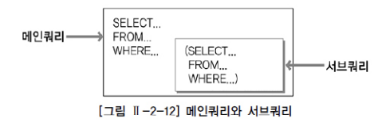
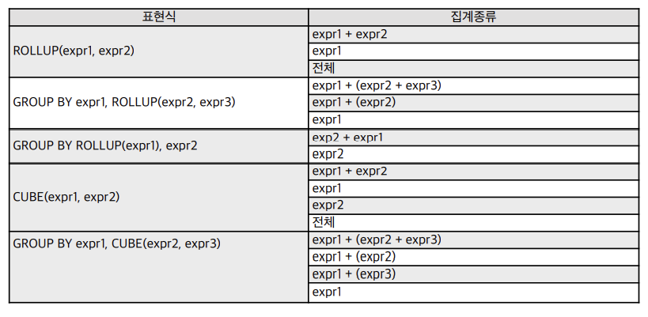
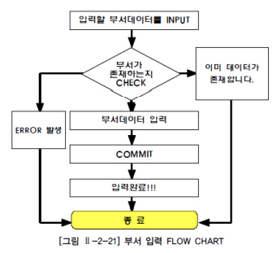

# 제 2장 데이터 모델과 성능

## 제 1절 성능 데이터 모델링의 개요

### 1. 성능데이터모델링의 정의

- 데이터모델링을 할 때 어떤 작업 유형에 따라 성능향상을 도모해야 하는지 목표를 분명하게 해야 정확한 성능향상 모델링을 할 수 있다.

### 2. 성능 데이터모델링 수행 시점

- 분석 / 설계단계에서 데이터베이스 처리 성능을 향상시킬 수 있는 방법을 고려해야 한다.

### 3. 성능 데이터 모델링 고려 사항

- 정규화, 반정규화..

## 제 2절 정규화와 성능

### 1. 정규화를 통한 성능향상 전략

- (중요) "데이터에 대한 중복성을 제거하여 준다."

- 일반적으로 정규화가 잘 되어 있으면 입력 / 수정 / 삭제의 성능이 향상되고 반정규화를 많이 하면 조회의 성능이 향상된다.

- 중복 속성에 대한 분리가 1차 정규화의 정의임. 로우단위의 대상, 칼럼 단위로 중복도 해당

### 2. 반정규화된 테이블의 성능저하 사례1 ~ 4

### 3. 함수적 종속성에 근거한 정규화 수행 필요(중요)

- 함수의 종속성(Functional Dependency)은 데이터들이 어떤 기준값에 의해 종속되는 현상을 지칭하는 것이다.

- 결정자 예) 주민등록번호 // 종속자 예) 이름, 출생지, 주소

## 제 3절 반정규화와 성능

### 1. 반정규화를 통한 성능향상 전략

- 반정규화의 정의
  
  - "정규화된 엔티티, 속성, 관계에 대해 시스템의 성능향상과 개발과 운영의 단순화를 위해 중복, 통합, 분리 등을 수행하는 데이터모델링 기법"
    
    조인으로 인한 성능 저하가 예상될 때 등

- 반정규화의 적용 방법
  
  - 반정규화 대상 조사, 다른 방법 유도 검토, 반정규화 적용

### 2. 반정규화 기법

- 테이블 반정규화 : 테이블병합, 테이블분할, 테이블추가

- 칼럼 반정규화 : 중복칼럼 추가, 파생칼럼 추가, 이력테이블칼럼 추가, PK에 의한 칼럼 추가, 응용시스템 오작동을 위한 칼럼 추가

- 관계 반정규화 : 중복관계추가

### 3. 정규화가 잘 정의된 데이터모델에서 성능이 저하될 수 있는 경우

### 4. 정규화가 잘 정의된 데이터모델에서 성능이 저하된 경우

## 제 4절 대량데이터에 따른 성능

### 1. 대량데이터 발생에 따른 테이블 분할 개요

- 로우 체이닝(Row Chaining) - '로우길이가 너무 길어서 데이터블록하나에 데이터가 모두 저장되지 않고 두개 이상 저장'

- 로우 마이그레이션(Row Migration) - '데이터블록에서 수정이 발생하면 수정된 데이터를 해당 데이터블록에서 저장하지 못하고 다른 블록의 빈 공간을 찾아 저장하는 방식'

### 2. 한 테이블에 많은 수의 갈럼을 가지고 있는 경우

### 3. 대량 데이터 저장 및 처리로 인한 성능

- RANGE PARTITION 적용

- LIST PARTITION 적용

- HASH PARTITION 적용

### 4. 테이블에 대한 수평 분할 / 수직 분할의 절차

## 제 5절 데이터베이스 구조와 성능

### 1. 슈퍼타입 / 서브타입 모델의 성능고려방법

- 슈퍼/서브타입 데이터모델의 개요
  
  - 'Extended ER 모델', 업무를 구성하는 데이터의 특징을 공통과 차이점의 특징을 고려하여 효과적으로 표현할 수 있기 때문에 자주 쓰임(공통은 슈퍼타입으로 모델링하고, 공통으로부터 상속받아 다른 엔티티와 차이가 있는 속성은 별도의 서브엔티티 구분)
  
  - 슈퍼 / 서브 타입 데이터 모의 변환
  
  - 슈퍼 / 서브타입 데이터모델의 변환 기술
  
  - 슈퍼 / 서브타입 데이터모델의 변환 타입 비교
    
    - OneToOne Type / Plus Type / Single Type

### 2. 인덱스 특성을 고려한 PK/FK 데이터베이스의 성능 향상(중요)

- 일반적으로 프로젝트에서는 PK/FK 칼럼 순서의 중요성을 인지하지 못한 채로 데이터모델링이 되어 있는 상태대로 바로 DDL을 생성함으로써 데이터베이스 데이터처리 성능에 문제를 유발하는 경우가 빈번하게 발생이 된다.
  
  - PK / FK 칼럼 순서와 성능 개요(중요)
    
    - 인덱스의 특징은 여러 개의 속성이 하나의 인덱스로 구성되어 있을 때 앞쪽에 위치한 속성의 값이 비교자로 있어야 인덱스가 좋은 효율을 나타낼 수 있다. 앞쪽에 위치한 속성값이 가급적 '=' 아니면 최소한 범위 BETWEEN이 들어와야 됨
  
  - PK 칼럼의 순서를 조정하지 않으면 성능이 저하 이유
    
    - PK의 순서를 인덱스 특징에 맞게 고려하지 않고 바로 그대로 생성하게 되면, 테이블에 접근하는 트랜잭션의 특징에 효율적이지 않은 인덱스가 생성되어 있으므로 인덱스의 범위를 넓게 이용하거나 Full Scan을 유발하게 되어 성능이 저하된다고 정리할 수 있다.
  
  - PK순서를 잘못 지정하여 성능이 저하된 경우 - 간단한 오류
  
  - PK순서를 잘못 지정하여 성능이 저하된 경우 - 복잡한 오류

### 3. 물리적인 테이블에 FK제약이 걸려있지 않을 경우 인덱스 미생성으로 성능저라

- 물리적인 테이블에 FK 제약 걸렀을 때는 반드시 FK 인덱스를 생성하도록 하고 FK 제약이 걸리지 않았을 경우에는 FK 인덱스를 생성하는 것을 기본정책으로 하되 발생되는 트랜잭션에 의해 거의 활용되지 않았을 때에만 FK 인덱스를 지우는 방법으로 하는 것이 적절한 방법

## 제 6절 분산데이터베이스와 성능


### 1. 분산데이터베이스의 개요

- 데이터베이스를 연결하는 빠른 네트워크 환경을 이용하여 데이터베이스를 여러 지역 여러 노드로 위치시켜 사용성 / 성능 등을 극대화시킨 데이터베이스

### 2. 분산데이터베이스의 투명성

- 분할, 위치, 지역 사상, 중복, 장애, 병행

### 3. 분산데이터베이스의 적용방법 및 장단점

- 분산데이터베이스 적용방법

- 분산데이터베이스 장단점

### 4. 분산데이터베이스의 활용 방향성

### 5. 데이터베이스 분산구성의 가치

### 6. 분산데이터베이스의 적용기법

- 테이블위치분산

- 테이블분할분산 - 수평분할, 수직분할

- 데이블복제분산 - 부분복제, 광역복제

- 테이블요약분산 - 분석요약, 통합요약

### 7. 분산데이터베이스를 적용하여 성능이 향상된 사례


## 제 2절 DDL

### 1. 데이터 유형

- CHARACTER(고정길이 문자열 정보), VARCHAR(), NUMERIC, DATE

| 데이터 유형      | 설명                                                                                                                                                                                                                         |
| ----------- | -------------------------------------------------------------------------------------------------------------------------------------------------------------------------------------------------------------------------- |
| CHARCTER(s) | - 고정 길이 문자열 정보(Oracle, SQL Server 모두 CHAR로 표현)<br/>- s는 기본 길이 1바이트, 최대 길이 Oracle 2,000바이트, SQL Server 8,000바이트<br/>- s만큼 최대 길이를 갖고 고정 길이를 가지고 있으므로 할당된 변수 값의 길이가 s보다 작을 경우에는 그 차이 길이만큼 공간으로 채워진다.                          |
| VARCHAR(s)  | - CHARACTER VARYING의 약자로 가변 길이 문자열 정보(Oracle은 VARCHAR2로 표현, SQL Server는 VARCHAR로 표현)<br/>- s는 최소 길이 1바이트, 최대 길이 Oracle 4,000바이트, SQL Server 8,000바이트<br/>- s만큼의 최대 길이를 갖지만 가변 길이로 조정이 되기 때문에 할당된 변수값의 바이트만 적용된다.(Limit 개념) |
| NUMERIC     | - 정수, 실수 등 숫자 정보(Oracle은 NUMBER로 , SQL Server는 10가지 이상의 숫자 타입을 가지고 있음)<br/>- Oracle은 처음에 전체 자리수를 지정하고, 그 다음 소수 부분의 자리수를 지정한다. 예를 들어 , 정수부분이 6자리이고 소수점 부분이 2자리인 경우에는 'NUMBER(8,2)'와 같이 된다.                                  |
| DATETIME    | - 날짜와 시각 정보(Oracle은 DATE로 표현, SQL Server는 DATETIME으로 표현)<br/>- Oracle은 1초 단위, SQL Server는 3.33ms(millisecond) 단위 관리ㅣ                                                                                                       |

### 2. CREATE TABLE

- SQL>>
  
  CREATE TABLE 테이블 이름
  
  (칼럼명1 DATATYPE [DEFAULT 형식],
  
  칼럼명1 DATATYPE [DEFAULT 형식],
  
  칼럼명1 DATATYPE [DEFAULT 형식]);

```sql
CREATE TABLE PLAYER 
 (PLAYER_ID CHAR(7) NOT NULL, PLAYER_NAME VARCHAR(20) NOT NULL, 
 TEAM_ID CHAR(3) NOT NULL, E_PLAYER_NAME VARCHAR(40), 
 NICKNAME VARCHAR(30), JOIN_YYYY CHAR(4), POSITION VARCHAR(10), 
 BACK_NO TINYINT, NATION VARCHAR(20), BIRTH_DATE DATE, SOLAR CHAR(1), 
 HEIGHT SMALLINT, WEIGHT SMALLINT, 
 CONSTRAINT PLAYER_PK PRIMARY KEY (PLAYER_ID), 
 CONSTRAINT PLAYER_FK FOREIGN KEY (TEAM_ID) REFERENCES TEAM(TEAM_ID) ); 
```

- 제약조건(CONSTRAINT): "사용자가 원하는 조건의 데이터만 유지하기 위한 방법"(중요)

CONSTRAINT 종류 : PRIMARY KEY, UNIQUE KEY, NOT NULL, CHECK, FOREIGN KEY

NULL은 "아직 정의되지 않은 미지의 값", "현재 데이터를 입력하지 못하는 경우"

DEFAULT는 데이터 입력 시에 칼럼의 값이 지정되어 있지 않을 경우 기본값을 설정 가능

- 생성된 테이블 구조 확인
  
  - Oracle - "DESCRIBE 테이블명;", SQL Server - "sp_help 'dbo.테이블명' "

- SELECT ㅁ누장을 통한 테이블 생성 사례
  
  - Create Table~ As Select~, Select~Into~

- 기존테이블의 제약조건 중 NOT NULL만 새로운 복제테이블에 적용됨

### 3. ALTER TABLE

SQL>>

AlTER TABLE 테이블 이름 ADD 속성_이름 데이터타입[DEFAULT]; // 추가

ALTER TABLE 테이블 이름 ADD 속성_이름[SET DEFAULT]; //속성명 변경

ALTER TABLE 테이블 이름 DROP 속성_이름[CASCADE|REATRICT]; //속성 삭제

```sql
 ALTER TABLE PLAYER ADD ADDRESS VARCHAR(80); 
 ALTER TABLE PLAYER DROP COLUMN ADDRESS; 
 ALTER TABLE TEAM_TEMP ALTER COLUMN ORIG_YYYY VARCAHR(8) NOT NULL; 
```

- DROP COLUMN 
  
  - 데이터가 있거나 없거나 모두 삭제 가능, 한번에 하나의 칼럼만 삭제 가능

- MODIFY COLUMN, RENAME COLUMN

- DROP CONSTRAINT
  
  - 테이블 생성 시 부여했던 제약조건을 삭제하는 명령어

- ADD CONSTRAINT
  
  - 테이블 생성 이후에 필요에 의해서 제약조건을 추가

### 4. RENAME TABLE

SQL>>

ALTER TABLE 테이블명

RENAME COLUMN 변경해야할 컬럼명 TO 새로운 컬럼명;

```sql
ALTER TABLE PLAYER
RENAME COLUMN PLAYER_ID TO TEAM_ID;
```

### 5. DROP TABLE

SQL>>

ALTER 

TABLE 테이블명 DROP COLUMN 삭제할 컬럼명;

```sql
 DROP TABLE PLAYER; —->(테이블 전부 삭제, 회복 불가) 
 ALTER TABLE PLAYER DROP COLUMN ADDRESS; —->(테이블의 일부 칼럼 삭제, 회복 불가) 
```

- 테이블의 모든 데이터 및 구조 삭제, CASECADE CONSTRAINT 옵션은 해당 테이블과 관계가 있었던 참조되는 제약조건에 대해서도 삭제한다는 뜻 , 복구X

### 6. TRUNCATE TABLE

SQL>>

TRUNCATE TABLE 테이블명 DROP COLUMN 삭제할 컬럼명;

- 테이블 자체가 삭제되는 것이 아니고, 해당테이블에 들어있던 모든 행들이 제거되는 것(테이터만 제거)

- 기존에 사용하던 테이블의 모든 로우를 제거하기 위한 명령어

## 제 3절 DML

### 1. INSERT

SQL>>

INSERT INTO 테이블명 (COLUMN_LIST) VALLUES (COLUMN_LIST에 넣을 VALUE_LIST):

INSERT INTO 테이블명 VALUES (전체 COLUMN에 넣을 VALUE_LIST):

PLAYER INSERT INTO PLAYER

(PLAYER_ID, PLAYER_NAME, TEAM_ID, POSITION, HEIGHT, WEIGHT, BACK_NO)-> (칼럼 리스트)

VALUES('2002007','박지성','Ko7','MF',178,73,7); -> (밸류 리스트)

### 2. UPDATE

SQL>>

UPDATE 테이블명 SET 수정되어야 할 컬럼명 = 수정되기를 원하는 새로운 값:

UPDATE PLAYER SET BACK_NO = 99;

UPDATE PLAYER SET POSITION = 'MF'; ->(문자값인 경우 ' ' 사용)

### 3. DELETE

SQL>>
DELETE FROM 삭제를 원하는 정보가 들어있는 테이블명 WHERE 조건절:

DELETE FROM PLAYER: -> (조건절이 없으면 전체 테이블 삭제)

### 4. SELECT

SQL>>

SELECT 칼럼명 FROM 테이블:

SELECT PLAYER_ID, PLAYER_NAME, TEAM_ID, POSITION FROM PLAYER:

SELECT DISTINCT POSITION FROM PLAYER: -> (DISTINCT : 중복테이블 1건으로 표시)

SELECT * FROM PLAYER: -> (모든 칼럼 선택)

SELECT PLAYER_NAME AS 선수명 FROM PLAYER: -> (AS: 칼럼명에 별명을 붙이고 별명으로 표시)

### 5. 산술연산자와 합성 연산자

SQL>>

SELECT PLAYER_NAME 이름, HEIGHT - WEIGHT "키- 몸무게" FROM PLAYER:

- 우선선위를 위한 괄호 적용이 가능하다. 일반적으로 산술 연산을 사용하거나 특정 함수를 적용하게 되면 기존의 칼럼에 대해 새로운 의미를 부여한 것이므로 적절한 ALIAS 를 새롭게 부여하는 것이 좋다.

Oracle SQL>>

SELECT PLAYER_NAME||'선수,' ||HEIGHT || 'cm,' || WEIGHT||'kg' 체격정보 FROM PLAYER:

SQL>>

SELECT PLAYER_NAME + '선수,' + HEIGHT +'cm,' + WEIGHT +'kg' 체격정보 FROM PLAYER:

> 정경량 선수 173cm, 65kg 정은익선수, 176cm, 63kg 레오마르 선수, 183cm, 77kg

## 제 4절 TCL

### 1. 트랜잭션 개요(중요)

- "데이터베이스의 논리적 연산 단위"

- 트랜잭션은 데이터베이스의 논리적 연산단위이다. 트랜잭션(TRANSACTION)이란 밀접히 관련되어 분리될 수 없는 한 개 이상의 데이터베이스 조작을 가리킨다. 하나의 트랜잭션에는 하나 이상의 SQL문장이 포함된다. 트랜잭션은 분할할 수 없는 최소의 단위이다. 그렇기 때문에 전부 적용하거나 전부 취소한다.

- 트랜잭션 특성(중요)
  
  - `원자성`, `일관성`, `고립성`, `지속성`

| 특성               | 설명                                                                            |
| ---------------- | ----------------------------------------------------------------------------- |
| 원자성(atomicity)   | 트랜잭션에서 정의된 연산들은 모두 성공적으로 실행되던지 아니면 전혀 실행되지 않은 상태로 남아 있어야 한다.(all or nothing)  |
| 일관성(consistency) | 트랜잭션이 실행되기 전의 데이터베이스 내용이 잘못 되어 있지 않다면 트랜잭션이 실행된 이후에도 데이터베이스의 내용에 잘못이 있으면 안된다. |
| 고립성(isolation)   | 트랜잭션이 실행되는 도중에 다른 트랜잭션의 영향을 받아 잘못된 셜과를 만들어서는 안된다.                             |
| 지속성(durability)  | 트랜잭션이 성공적으로 수행되면 그 트랜잭션이 갱신한 데이터베이스의 내용은 영구적으로 저장된다.                          |

## [TCL(TRANSACTION CONTROL LANGUAGE]\(중요)

- 커밋(COMMIT) : 올바르게 반영된 데이터를 데이터베이스에 반영시키는 것

- 롤백(ROLLBACK) : 트랜잭션 시작 이전의 상태로 되돌리는 것

- 저장점(SAVEPOINT) : 저장점 기능

### 2. COMMIT

Oracle SQL >>

UPDATE PLAYER SET HEIGHT = 100;

COMMIT;

SQL>>

UPDATE PLAYER SET HEIGHT = 100;

- Oracle 은 DML문장 수행 후 사용자가 임의로 COMMIT 또는 ROLLBACK 수행해줘야 함

- SQL SERVER는 기본적으로 AUTO COMMIT

### 3. ROLLBACK

Oracle SQL>>

UPDATE PLAYER SET HEIGHT = 100; 

ROLLBACK;

SQL>>

BEGIN TRAN UPDATE PLAYER SET UPDATE = 100;

ROLLBACK;

- 테이블 내 입력한 데이터나 수정한 데이터, 삭제한 데이터에 대하여 COMMIT 이전으로 되돌려, 변경사항을 취소할 수 있는데 데이터베이스에서는 롤백(ROLLBACK) 기능을 사용한다.

### 4. SAVEPOINT

SQL>>

SAVEPOINT 세이브포인트명;

SAVEPOINT SVPT1;

ROLLBACK TO SVPT1;

- 저장점을 정의하면 롤백할 때 트랜잭션에 포함된 전체 작업을 롤백하는 것이 아니라 현 시점에서 SAVEPOINT까지 트랜잭션의 일부만 롤백할 수 있다.

## 제 5정 WHERE 절

### 1. WHERE 조건절 개요

- "자신이 원하는 자료만을 검색하기 위해 이용"

WHERE

SQL>>

SELECT [DISTINCT/ALL] 칼럼명[ALIAS명]FROM 테이블명 WHERE 조건식;

SELECT PLAYER_NAME FROM PLAYER WHERE TEAM_ID = 'K02';

SELECT PLAYER_NAME, POSITION,BACK_NO, HEIGHT FROM PLAYER WHERE HEIGHT >= 170;

- 괄호로 묶은 연산이 제일 먼저 연산 처리된다.

- 연산자들 중에는 부정 연산자(NOT)가 먼저 처리되고

- 비교 연산자(=,>,>=,<,<=), SQL 비교 연산자(BETWEEN a AND b, IN(list), IS NULL)가 처리되고

- 논리 연산자 중에서는 AND, OR의 순으로 처리된다.

- 처리 순서(중요) : 부정 연산자 -> 비교 연산자 -> 논리 연산자

### 2. 연산자의 종류

- 비교 연산자, SQL연산자, 논리 연산자, 부정 비교 연산자, 부정 SQL 연산자


### 3. SQL 연산자

- IN(list)연산자, LIKE 연산자, BETWEEN a AND b 연산자, IS NULL 연산자


SQL>>

SELECT ENAME, JOB, DEPTNO FROM EMP WHERE (JOB, DEPTNO) IN (('MANAGER',20),('CLERK',30));

사원 테이블(EMP)에서 JOB이 MANAGER이면서 20번 부서에 속하거나, JOB이 CLERK이면서 30번 부서에 속하는 사원의 정보(ENAME,JOB,DEPTNO)를 IN 연산자의 다중 리스트를 이용해 출력하라.

SELECT PLAYER_NAME, POSITION, BACK_NO, HEIGHT FROM PLAYER WHERE POSITION LIKE 'MF';

SELECT PLAYER_NAME, POSITION, BACK_NO, HEIGHT FROM PLAYER WHERE PLAYER_NAME LIKE '장%';

'장'씨 성을 가진 선수들의 정보를 조회하는 WHERE절

- 와일드 카드 종류

| 와일드 카드 | 설명                  |
| ------ | ------------------- |
| %      | 0개 이상의 어떤 문자를 의미한다. |
| _      | 1개인 달일 문자를 의미한다.    |

"BETWEEN a AND b" -> "a 이상 b 이하"

SELECT PLAYER_NAME, POSITION, BACK_NO, HEIGHT FROM PLAYER WHERE HEIGHT BETWEEN 170 AND 180;

키가 170cm 이상 180cm이하인 선수들의 정보

### 4. IS NULL(중요) / IS NOT NULL

- NULL은 값이 존재하지 않는 것으로 확정되지 않은 값으 표현할 때 사용한다.

- 따라서 어떤 값보다 크거나 작지도 않고 ''(공백)이나 0(zero)와 달리 비교 자체가 불가능한 값인 것이다.

- 어떤 값과 비교할 수도 없으며, 특정 값보다 크다, 적다라고 표현할 수 없다.

- NULL값과의 수치연산은 NULL 값을 리턴한다.(중요)

- NULL 값과의 비교연산은 거짓(FALSE)을 리턴한다.(중요)

SQL>>

SELECT PLAYER_NAME 선수이름, POSITION 포지션, TEAM_ID FROM PLAYER WHERE POSITION IS NULL;

결과 >> 포지션 테이블에서 포지션이 NULL값을 갖는 선수 이름, 포지션, 팀 ID를 출력하라

### 5. 논리 연산자



“소속이 삼성블루윙즈이고 키가 170 센티미터 이상인 조건을 가진 선수들의 자료를 조회” 
SQL>> 
SELECT PLAYER_NAME 선수이름, POSITION 포지션, BACK_NO 백넘버, HEIGHT 키 FROM PLAYER 
WHERE TEAM_ID = 'K02' AND HEIGHT >= 170; 

***

“소속이 삼성블루윙즈이거나 전남드래곤즈인 선수들 중에서 포지션이 MF인 선수들 자료를 조회” 
SQL>> 
SELECT PLAYER_NAME 선수이름, POSITION 포지션, BACK_NO 백넘버, HEIGHT 키 FROM PLAYER 
WHERE TEAM_ID IN ('K02','K07') AND POSITION = 'MF'; 

***

“소속팀이 삼성블루윙즈이거나 전남드래곤즈에 소속된 선수들이어야 하고, 포지션이 미드필더(MF)이며 
키는 170 센티미터 이상이고 180 이하인 선수들 자료를 조회” 
SQL>> 
SELECT PLAYER_NAME 선수이름, POSITION 포지션, BACK_NO 백넘버, HEIGHT 키 FROM PLAYER 
WHERE (TEAM_ID = 'K02' OR TEAM_ID = 'K07') AND POSITION = 'MF' 
AND HEIGHT >= 170 AND HEIGHT <= 180;

- 논리 연산자들이 여러 개가 같이 사용되었을 때의 처리 우선순위는 (), NOT, AND, OR의 순서대로 처리된다.(중요)

### 6. 부정 연산자


“삼성블루윙즈 소속인 선수들 중에서 포지션이 미드필더(MF)가 아니고, 
키가 175 센티미터 이상 185 센티미터 이하가 아닌 선수들의 자료를 찾아본다.” 

SQL>> 
SELECT PLAYER_NAME 선수이름, POSITION 포지션, BACK_NO 백넘버, HEIGHT 키 FROM PLAYER 
WHERE TEAM_ID = 'K02' AND POSITION <> 'MF' AND HEIGHT NOT BETWEEN 175 AND 185;

### 7. ROWNUM & TOP

- SQL 처리 결과 집합의 각 행에 대해 임시로 부여되는 일련번호

Oracle - ROWNUM

- Oracle 의 ROWNUM은 컬림과 비슷한 성격의 Pseudo Column으로써 SQL처리 결과 집합의 각 행에 대해 임시로 부여되는 일련번호이며, 테이블이나 집합에서 원하는 만큼의 행만 가져오고 싶을 때 WHERE 절에서 행의 개수를 제한하는 목적으로 사용한다.

Oracle SQL>> 
“MY_TABLE 이라는 테이블의 첫번 째 칼럼을 ‘고유한 키’값 혹은 ‘인덱스 값’으로 설정하라!" 
—> 새롭게 넘버링 칼럼을 설정하고, 그 값을 기 테이블의 ‘고유한 키’값 혹은 ‘인덱스 값’으로 설정 
UPDATE MY_TABLE SET COLUMN1 = ROWNUM; 

***

“PLAYER 테이블에서 PLAYER_NAME 번호가 3 이하인 선수 이름을 출력하라” 
SELECT PLAYER_NAME FROM PLAYER WHERE ROWNUM <= 3;

****

SQL - TOP

- SQL Server는 TOP 절을 사용하며 결과 집합으로 출력되는 행의 수를 제한할 수 있다.

- Expression : 반환할 행의 수를 지정하는 숫자이다.

- PERCENT : 쿼리 결과 집합에서 처음 EXPREDDION%의 행만 반환됨을 나타낸다.

- WITH TIES : ORDER BY 절이 지정된 경우에만 사용할 수 있으며, TOP N(PERCENT)의 마지막 행과 같은 값이 있는 경우 추가 행이 출력되도록 지정할 수 있다.

SQL>> 
TOP (Expression) [PERCENT] [WITH TIES]; 
“PLAYER 테이블에서 1~5행까지의 PLAYER_NAME 을 출력하라” 
SELECT TOP(5) PLAYER_NAME FROM PLAYER;

****

- SQL 문장에서 ORDER BY 절이 사용되지 않으면 Oracle의 ROWNUM과 SQL Server의 TOP절은 같은 기능을 하지만, ORDER BY절이 같이 사용되면 기능의 차이가 발생한다.

## 제 6절 함수

### 1. 내장 함수 개요

- 함수는 입력되는 값이 많아도 출력은 하나만 됨(M:1)



### 2. 문자형 함수


“경기장의 지역번호와 전화번호를 합친 번호의 길이를 구하시오.” 
SELECT STADIUM_ID, DDD+TEL as TEL, LEN(DDD+TEL) as T_LEN FROM STADIUM; 
—-> (LEN -> 문자열의 갯수를 숫자값으로 리턴)

### 3. 숫자형 함수


### 4. 날짜형 함수



Oracle SQL>> 
“사원(EMP) 테이블의 입사일자에서 년, 월, 일 데이터를 각각 출력한다.” 
EXTRACT(MONTH FROM HIREDATE) 입사월, EXTRACT(DAY FROM HIREDATE) 입사일 FROM EMP; 

****

SQL>> 
“사원(EMP) 테이블의 입사일자에서 년, 월, 일 데이터를 각각 출력한다.” 
SELECT ENAME, HIREDATE, DATEPART(YEAR, HIREDATE) 입사년도, 
DATEPART(MONTH, HIREDATE) 입사월, DATEPART(DAY, HIREDATE) 입사일 FROM EMP; 
(or 다음도 같은 코드) 
SELECT ENAME, HIREDATE, YEAR(HIREDATE) 입사년도, MONTH(HIREDATE) 입사월, 
DAY(HIREDATE) 입사일 FROM EMP;

### 5. 변환형 함수


### 6. CASE 표현

- IF - THEN - ELSE논리와 유사한 방식    

SQL>> 
“사원 정보에서 급여가 3000 이상이면 상등급으로, 1000 이상이면 중등급으로, 1000 미만이면 하등급으로 분류하라.” 
SELECT ENAME, 
CASE WHEN SAL >= 3000 THEN 'HIGH' WHEN SAL >= 1000 THEN 'MID' 
ELSE 'LOW' END 
AS SALARY_GRADE FROM EMP;

### 7. NULL 관련 함수

#### 가. NVL / ISNULL 함수(중요)

- 표현식 1의 값이 NULL이면 표현식2 값을 출력한다.

- 출력값을 NULL이 아닌 다른 값을 얻고자 할 때 NVL / ISNULL함수를 사용한다.

- NULL값의 대상이 숫자 유형 데이터인 경우는 주로 0(Zero)으로, 문자 유형 데이터인 경우는 블랭크보다는 'x' 같이 해당 시스템에서 의미 없는 문자로 바꾼다.


#### 나. NULL과 공집합

- SELECT 1 FROM DUAL WHERE 1 = 2; 와 같은 조건이 대표적인 공집합을 발생시키는 쿼리이며, 위와 같이 조건에 맞는 데이터가 한 건도 없는 경우를 공집합이라고 하고, NULL 데이터와는 또 다르게 이해해야 한다.

#### 다. NULLIF(표현식1, 표현식2)

- 표현식1이 표현식2와 같으면 NULL을, 같지 않으면 표현식1을 리턴한다.

SQL>> 
“사원 테이블에서 MGR와 7698이 같으면 NULL을 표시하고, 같지 않으면 MGR를 표시한다.” 
SELECT ENAME, EMPNO, MGR, NULLIF(MGR,7698) NUIF FROM EMP;

#### 라. COALESCE(표현식1, 표현식2, ...)(중요)

- 임의의 개수 표현식에서 NULL이 아닌 최초의 표현식을 타나낸다.

- COALESCE 함수는 인수의 숫자가 한정되어 있지 않으며, 임의의 개수 EXPR에서 NULL이 아닌 최초의 EXPR을 나타낸다.

- 임의의 개수 EXPR에서 NULL이 아닌 최초의 EXPR을 나타낸다.

- 만일 모든 EXPR이 NULL이라면 NULL을 리턴한다.

SQL>> 
“사원 테이블에서 커미션(COMM)을 1차 선택값으로, 급여(SAL)를 2차 선택값으로 선택하되 
두 칼럼 모두 NULL인 경우는 NULL로 표시한다.” 
SELECT ENAME, COMM, SAL, COALESCE(COMM, SAL) COAL FROM EMP;

## 제 7절 GROUP BY, HAVING절

### 1. 집계함수

- 여러 행들의 그룹이 모여서 그룹 당, 단 하나의 결과를 돌려주는 다중행 함수중 하나

- GROUP BY절은 행들을 소그룹화 한다.

- SELECT 절, HAVING절, ORDER BY절에 사용할 수 있다.


### 2. GROUP BY

- ROLLUP이나 CUBE에 의한 소계가 계산된 결과에는 GROUPING(EXPR) = 1이 표시됨

- 그외의 결과에는 GROUPING(EXPR)=0이 표시된다.

SQL>> 
SELECT [DISTINCT] 칼럼명 [ALIAS명] FROM 테이블명 [WHERE 조건식] 
[GROUP BY 칼럼(Column)이나 표현식] [HAVING 그룹조건식] ; 

****

“K-리그 선수들의 포지션별 평균키는 어떻게 되는가?”
 SELECT POSITION 포지션, COUNT(*) 인원수, COUNT(HEIGHT) 키대상, MAX(HEIGHT) 최대키, 
MIN(HEIGHT) 최소키, ROUND(AVG(HEIGHT),2) 평균키 FROM PLAYER GROUP BY POSITION; 
결과 >>> 포지션 인원수 키대상 최대키 43 43 196 174 186.26 DF 172 142 190 170 180.21 
FW 100 100 194 168 179.91 MF 162 162 189 165 176.31

### 3. HAVING

-HAVING 절은 WHERE 절과 비슷하지만 그룹을 나타내는 결과 집합의 행에 조건이 적용된다.

SQL>> 
“HAVING 절을 이용해 평균키가 180 센티미터 이상인 정보만 표시” 
SELECT POSITION 포지션, ROUND(AVG(HEIGHT),2) 평균키 FROM PLAYER 
GROUP BY POSITION HAVING AVG(HEIGHT) >= 180;

### 4. CASE 표현을 활용한 월별 데이터 집계

- "집계 함수(CASE()) ~ GROUP BY" 기능은, 모델링의 제1정규화로 인해 반복되는 칼럼의 경우 구분 칼럼을 두고 여러 개의 레코드로 만들어진 집합을 , 정해진 칼럼 수만큼 확장해서 집계보고서를 만드는 유용한 기법이다.

### 5. 집계함수와 NULL 처리

- 리포트 출력 때 NULL이 아닌 0을 표시하고 싶은 경우에는 NVL(SUM(SAL),0)이나, ISNULL(SUM(SAL),0)처럼 전체 SUM의 결과가 NULL인 경우(대상 건수가 모두 NULL인 경우)에만 한번 NVL / ISNULL 함수를 사용하면 된다.

## 제 8절 ORDER BY

### 1. ORDER BY(중요)

- ORDER BY 절은 SQL 문장으로 조회된 데이터들을 다양한 목적에 맞게 특정 칼럼을 기준으로 정렬하여 출력하는데 사용

- ORDER BY절에 칼럼명 대신에 SELECT 절에서 사용한 ALIAS 명이나 칼럼 순서를 나타내는 정수도 사용 가능

- 기본적으로 오름차순

SQL>> 
“선수 테이블에서 선수들의 이름, 포지션, 백넘버를 출력하는데 사람 이름을 내림차순(DESC)으로 정렬하여 출력 
키가 NULL인 데이터는 제외” 
SELECT PLAYER_NAME 선수명, POSITION 포지션, BACK_NO 백넘버 FROM PLAYER 
WHERE BACK_NO IS NOT NULL ORDER BY PLAYER_NAME DESC;

### 2. SELECT 문장 실행 순서

1. 발췌 대상 테이블을 참조한다.(FROM)

2. 발췌 대상 데이터가 아닌 것은 제고한다.(WHERE)

3. 행들을 소그룹화 한다.(GROUP BY)

4. 그룹핑된 값의 조건에 맞는 것만을 출력한다.(HAVING)

5. 데이터 값을 출력 / 계산한다.(SELECT) 

6. 데이터를 정렬한다.(ORDER BY)


### 3. Top N 쿼리

SQL>> 
“사원 테이블에서 급여가 높은 2명을 내림차순으로 출력하는데 같은 급여를 받는 사원이 있으면 같이 출력한다.” 
SELECT TOP(2) WITH TIES ENAME, SAL FROM EMP ORDER BY SAL DESC; 
결과 >>> KING 5000 SCOTT 3000 FORD 3000

## 제 9절 조인

### 1. JOIN 개요

"두개 이상의 테이블들을 연결 또는 결합하여 데이터를 출력하는 것"

### 2. EQUI JOIN

- 두 개의 테이블간에 칼럼 값들이 서로 정확하게 일치하는 경우에 사용되는 방법

- 대부분 PK <->FK의 관계를 기반으로 한다. 그러나 반드시 PK <->FK의 관계로만 EQUI JOIN 이 성립하는 것은 아니다.

SQL>> 
“선수 테이블과 팀 테이블에서 선수 이름과 소속된 팀의 이름을 출력하시오.” 
SELECT PLAYER.PLAYER_NAME 선수명, TEAM.TEAM_NAME 소속팀명 FROM PLAYER, TEAM 
WHERE PLAYER.TEAM_ID = TEAM.TEAM_ID; 

****

->(다음도 같은 코드) 
SELECT PLAYER.PLAYER_NAME 선수명, TEAM.TEAM_NAME 소속팀명 FROM PLAYER 
INNER JOIN TEAM ON PLAYER.TEAM_ID = TEAM.TEAM_ID;

### 3. Non EQUI JOIN

- 두 개의 테이블 간에 칼럼 값들이 서로 정확하게 일치하지 않는 경우에 사용된다.

- Non EQUI JOIN의 경우네는 "=" 연산자가 아닌 다른 (Between, >, >=, <,<= 등) 연산자들을 사용하여 JOIN을 수행

- 4.3개 이상 TABLE JOIN

SQL>> 
“선수들 별로 홈그라운드 경기장이 어디인지를 출력하고 싶다고 했을 때, 
선수 테이블과 운동장 테이블이 서로 관계가 없으므로 중간에 팀 테이블이라는 서로 연관관계가 있는 테이블을 
추가해서 세 개의 테이블을 JOIN 해야만 원하는 데이터를 얻을 수 있다.” 
SELECT P.PLAYER_NAME 선수명, P.POSITION 포지션, T.REGION_NAME 연고지, T.TEAM_NAME 팀명, 
S.STADIUM_NAME 구장명 FROM PLAYER P, TEAM T, STADIUM S 
WHERE P.TEAM_ID = T.TEAM_ID AND T.STADIUM_ID = S.STADIUM_ID 
ORDER BY 선수명; 

****

->(다음도 같은 코드) 
SELECT PLAYER.PLAYER_
 SELECT P.PLAYER_NAME 선수명, P.POSITION 포지션, T.REGION_NAME 연고지, T.TEAM_NAME 팀명, 
S.STADIUM_NAME 구장명 FROM PLAYER P INNER JOIN TEAM T ON P.TEAM_ID = T.TEAM_ID 
INNER JOIN STADIUM S ON T.STADIUM_ID = S.STADIUM_ID ORDER BY 선수명;
